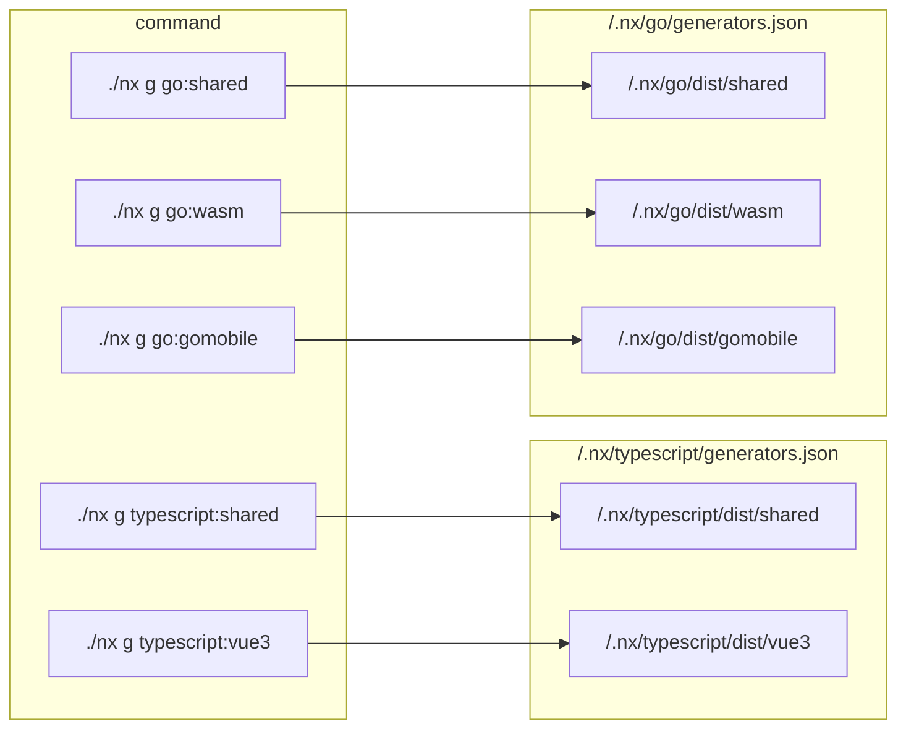

# How to use Nx

[Nx](https://nx.dev) scaffolds, builds, tests and publishes packages.

Nx scans the directories in `app-stencils`, looking for `project.json` files. Each `project.json` file specifies **targets**. Targets are tasks that Nx can perform upon a directory. Each target contains an **executor** and **options**. Executors are procedures that nx can run. Options are configuration that Nx passes into the executor. For example:

```json
{
  "root": "./typescript",
  "targets": {
    "install": {
      "executor": "nx:run-commands",
      "options": {
        "command": "cd ./typescript && pnpm i"
      }
    }
  }
}
```

> The `install` target uses the `nx:run-commands` executor. This executor reads the `options`, and runs the command `cd ./typescript && pnpm i`.

Nx also provides **generators**. A generator is a procedure that Nx runs in order to create a new directory. Generators can stub files, update dependencies, and even set up project.json files.

To run a generator, `cd` to the root of this repository, and run any of the following commands:

| Command                    | What it does                                                                                                                   |
| :------------------------- | :----------------------------------------------------------------------------------------------------------------------------- |
| `./nx g typescript:vue3`   | creates a vue3 component or plugin in /typescript/vue3/<package>                                                               |
| `./nx g typescript:shared` | creates a shared library in /typescript/shared/<package>                                                                       |
| `./nx g go:gomobile`       | creates a golang shared library that can be run within an iOS, iPadOS, MacOS, or android application in /go/gomobile/<package> |
| `./nx g go:wasm`           | creates a golang program or library that can be run within a webassembly runtime in /go/wasm/<package>                         |
| `./nx g go:shared`         | creates a golang library that can be imported into any other go package in /go/shared/<package>                                |

<!-- todo: figure out a way to autogenerate this list, and also the corresponding list in CONTRIBUTE -> create-packages

  perhaps we could use mdc + docus (for now) and also have it render markdown.

  then we could gitexclude all .md files and have the markdown generated by a builder in github??

 -->

## Create a generator

Nx searches the [typescript/package.json](./typescript/package.json) and [go/package.json](./go/package.json) package manifests for generators.

Each of these package manifests has a `generators` key. For example:

```json
{
  "name": "typescript",
  "generators": "./generators.json",
  "executors": "./executors.json",
  "main": "./dist/index.js",
  "private": true,
  "scripts": {
    "build": "tsc"
  },
  "dependencies": {
    "@nrwl/devkit": "16.5.2"
  },
  "devDependencies": {
    "@types/node": "20.4.1",
    "typescript": "^5.1.6",
    "vite": "^4.4.2"
  },
  "peerDependencies": {
    "nx": "16.5.2"
  },
  "version": "0.0.1"
}
```

> the [typescript/package.json](./typescript/package.json) has a `generators` entry that points to the directory's [`./typescript/generators.json`](./typescript/generators.json) file.

The `generators.json` file contains a `generators` object. This object contains an `implementation`, a `schema`, and a `description`. For example:

```json
{
  "$schema": "http://json-schema.org/schema",
  "generators": {
    "shared": {
      "implementation": "./dist/shared",
      "schema": "./src/shared.json",
      "description": "Scaffold a typescript library that can be used in vue3 components and directives, and in bun or Node JS runtimes"
    }
  }
}
```

> the `shared` generator inside the [`./typescript/generators.json`](./typescript/generators.json) file.

- [`implementation`]() is the code that Nx runs when the generator is invoked. e.g. `nx g typescript:shared` runs [`./dist/typescript/shared.ts`](./typescript/dist/shared.ts). Note that the `.ts` extension is dropped from `./dist/typescript/shared.ts`

- `schema` is the configuration that Nx uses to populate its [command line options](https://nx.dev/extending-nx/recipes/generator-options).

- `description` is the the information that Nx provides when `nx list typescript` or `nx list go` is run.
  - if you add a generator to the [`typescript`](./typescript/generators.json) directory, its description will appear when you run `nx list typescript`
  - if you add a generator to the [`go`](./go/generators.json) directory, its description will appear when you run `nx list go`



> When you run a generator, Nx uses the generators.json file to find the code to run

<!-- explain the api for generator - what is the function that is run? what nx devkit apis can be used within the function? -->

<!-- ## Configure dependency inference

todo: explain how dependency inference works, what are the apis and hooks needed at the plugin level? explain that typescript and go folders are actually plugins, and that nx uses ./dist/index.js
-->

<!-- to build/update, run ./nx -->
