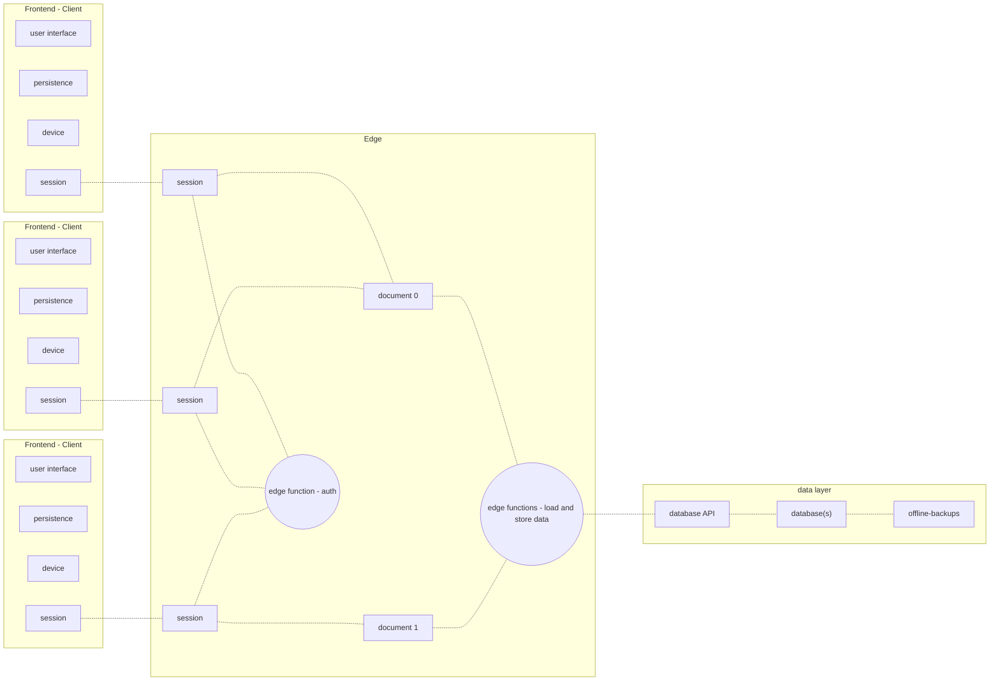

# app-stencils

Low-code tools are faster and easier to use than code, but they impose hard limits on what you can build. At incremental.design, we use `app-stencils` to make no-compromise apps faster than low-code.

Custom development doesn't have to be difficult. Most apps have to solve the same problems:

- respond to user input without latency
- persist user data to session storage
- interact with the host device
- shuttle data to and from the edge

> An example of the components in an app that supports real-time collaboration.
> Every client starts a session. Sessions synchronize activity between cients and the edge. Sessions authenticate clients, and modify documents. Documents load and store data from the data layer.

Low-code tools have a lower learning curve than code, because they solve these problems, and hide the details from you. However, they also cut corners. Most fail at responding to touch, stylus and assistive device input. Most limit how and where you can persist data, and many skip the edge entirely when shuttling data between client and server. They leave subtle fractures in the user experience, and because they hide the details, it's impossible to fill in the cracks.

`app-stencils` contains all of the reusable components that `incremental.design` uses to make frontends and edge services for web apps. These components are designed to work when deployed as web apps, progressive web apps, or hybrid apps on desktop and mobile. They consist of user interfaces that respond to a wide range of inputs, and business logic that handles authentication, session storage, and synchronization between the client and the edge.

There are plenty of libraries for user interface component libraries, design systems, and libraries for authentication, persistence, and synchronization. However, these components have to be tested and shimmed together. `app-stencils` takes care of that. All of these components are tested to work together seamlessly.

`app-stencils` solves the same set of problems as low code tools, without hiding all the details from you. With `app-stencils`, you can build as fast as you can with a low-code tool, without getting locked into the same limitations.

<!--
not sure where to put this ... what does finger-friendly mean?

1. components have variants that are sized for fingertips, rather than mouse cursors
2. components respond to tap and drag and most importantly: pinch
3. components do not rely on hover
4. components respond to stylus as a form of input

why is it so important?

1. a LOT of people use tablets: iPads, Galaxy Tab, Google tablet, etc.
2. tablets aren't 'laptops without keyboards' - they are devices that are meant to be held, tapped, and written on.
3. novelty turns friction into desirable friction. you can leverage the tablet input paradigms to inject novelty into an otherwise boring web app
4. most native apps have web views. Some 'native' apps are just wrappers around web views. Web views have to be as finger-friendly as the interfaces that surround them.
5. most web apps will NEVER gain native counterparts. It's too expensive for a web dev team to justify making a separate native app and maintaining feature parity. These apps will become progressive web apps. PWAs need to be finger friendly

possible this needs to be a ~600 word blog post that is linked from here
 -->

## How to use app-stencils:

<!--
Link to a webpage, web shell (e.g. runkit), or downloadable executable that demonstrates the project.
        * note that when the reader is modifying the code, they will compare their modified version to the demo to see if their changes worked as they expected them to. Your demo is their reference
-->

### Installation:

<!--Explain how to import the modules of the project into the reader's codebase, install the containers of the project in the reader's cluster, or flash the binary of the project onto the reader's hardware-->

### Modules:

<!--
List the methods or modules your project provides.
-->

## How app-stencils works:

<!--
Explain how execution works. What is the entry point for your code? Which files correspond to which functionality? What is the lifecycle of your project? Are there any singletons, side effects or shared state among instances of your project? Take extra care to explain design decisions. After all, you wrote an ENTIRE codebase around your opinions. Make sure that the people using it understand them.
-->

## Roadmap:

<!--
https://vuejs.org/api/sfc-css-features.html#v-bind-in-css
https://partytown.builder.io/
https://floating-ui.com/
https://www.shadergradient.co/
https://docs.pmnd.rs/react-three-fiber/getting-started/examples
https://vite-pwa-org.netlify.app/
https://github.com/fluent-vue/fluent-vue
https://gridjs.io/
https://github.com/PuruVJ/neodrag
image-auto-sprite-sheet: a way to automatically break giant images up into smaller sprites. consider using seadragon
pinia
motion one + motion one dev tools
motion canvas
theatreJS(?)

timeloop API needs to represent animation as a STEADY STATE - so that vue doesn’t re-render due to changes in Animation (same with video player). Essentially, vue should be able to set props and call methods, and the internal updates of the component should all be handled imperatively on a requestAnimationFrame loop

export as:
web component
vue component
  build.cssCodeSplit true for lib mode to inline styles?Or, use vue custom module to inline styles

test with:
vitedge for individual demo pages (and *maybe* for each demo page)

• add 3D to website capabilities
• Start by replacing all assets in incremental.design website with 3D assets
• react 3D fiber
• exported as esmodule for framer
• shimmed into vue via web component
• and eventually replaced with troisjs
• Make custom charting capabilities
• Using D3 + canvas for 2D charts
• And D3 + troisJS for 3D charts
• Also explore motion canvas

vitedge only (drop to ssr if >1mb)

uxlens

 -->

## [Contribute to App Stencils](CONTRIBUTE.MD)
