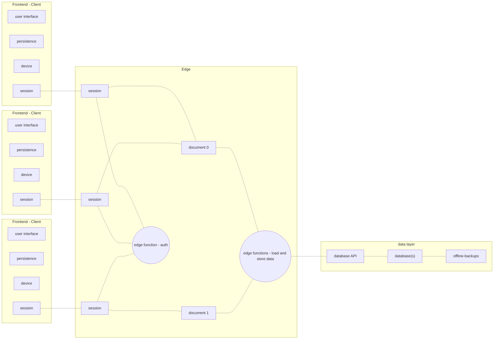

# Project Name

<!--
Add a banner image and badges

see: https://towardsdatascience.com/how-to-write-an-awesome-readme-68bf4be91f8b
-->

<!-- link to your reader to your repository's bug page, and let them know if you're open to contributions -->

Low-code tools are faster and easier to use than code, but they impose hard limits on what you can build. At incremental.design, we use `app-stencils` to make no-compromise apps faster than low-code.

Custom development doesn't have to be difficult. Most apps have to solve the same problems:

- respond to user input without latency
- persist user data to session storage
- interact with the host device
- shuttle data to and from the edge

> An example of the components in an app that supports real-time collaboration.
> Every client starts a session. Sessions synchronize activity between cients and the edge. Sessions authenticate clients, and modify documents. Documents load and store data from the data layer.

Low-code tools have a lower learning curve than code, because they solve these problems, and hide the details from you. However, they also cut corners. Most fail at responding to touch, stylus and assistive device input. Most limit how and where you can persist data, and many skip the edge entirely when shuttling data between client and server. They leave subtle fractures in the user experience, and because they hide the details, it's impossible to fill in the cracks.

`app-stencils` contains all of the reusable components that `incremental.design` uses to make frontends and edge services for web apps. These components are designed to work when deployed as web apps, progressive web apps, or hybrid apps on desktop and mobile. They consist of user interfaces that respond to a wide range of inputs, and business logic that handles authentication, session storage, and synchronization between the client and the edge.

There are plenty of libraries for user interface component libraries, design systems, and libraries for authentication, persistence, and synchronization. However, these components have to be tested and shimmed together. `app-stencils` takes care of that. All of these components are tested to work together seamlessly.

`app-stencils` solves the same set of problems as low code tools, without hiding all the details from you. With `app-stencils`, you can build as fast as you can with a low-code tool, without getting locked into the same limitations.

## Installation:

Add Project Name to your codebase.
asciicast, video or GIF of adding to your project and using it

## Usage:

[ ] Make a bulleted list of each class, method, or function that your project exports. Link each list item directly to the file that defines it.

### How Project Name works:

[ ] Explain how execution works. What is the entry point for your code? Which files correspond to which functionality? What is the lifecycle of your project? Are there any singletons, side effects or shared state among instances of your project? Take extra care to explain design decisions. After all, you wrote an ENTIRE codebase around your opinions. Make sure that your repository's contributors understand them.

## Roadmap:

[ ] List the releases that you have added to each project, and any future releases you would like to do. If there is a date for future release, put it here. If not, let people know that there is no defined timeframe for future releases.

All typescript modules are located in `packages/shared`. As the name suggests, these modules are shared among multiple components. They can also be used independently of Vue 3. So, if you want to make react, svelte, or web components, you can use these modules to get started

## [Contribute to App Stencils](CONTRIBUTE.MD)

<!--

==================

vue websites:

vitedge only (drop to ssr if >1mb)

vitest + playwright

vite plugin pwa

typescript (done)

Editorconfig

pinia

partytown

supertokens (eventually)

surrealdb in browser (eventually)

uxlens

strapi or directus for content api ... or maybe just supabase?

some kind of caching strategy??

for this repo, all of the site content will be served from strapi. Here's how it will work:

there will be a site: appstencils.io (or something like it)

this site will contain vue router, and an authentication mechanism. vue router will call out to strapi, and supply authentication credentials.

strapi will respond with a JSON document that contains an array of objects, each of which describes a section of documentation (e.g. a paragraph of text, a code block, an interactive sandbox, etc.)

vue router will use <component :is="" > to load in the content from strapi and display the docs.

in the case that vue router does not supply authentication, strapi will respond with a JSON document that contains the same array of objects. However, the text in the documentation will be replaced with hipster ipsum. The idea is that you can only access the documentation text if you authenticate.

To authenticate, you will have to create a .env file with your auth credentials. vue router will scoop up those credentials when you launch the site.

when this site is deployed, it will secure the content WITHOUT auth. Instead, it will use CORS to make sure that only appstencils.io can request the text from strapi

==================

vue libraries

vitest + playwright

editorconfig (no prettier, no eslint)

typescript (done)

some way to bundle <style> blocks (done w <style module>)

==================

-->

North Star

Infra for: product design studio

what is a product design studio?

• https://uxdesign.cc/introducing-mercury-os-f4de45a04289

## Make website with Vue 3 as fast as making them in framer

• finish what we originally started: a website where every component is from app-stencils, and every component can be re-used on the next client project
• Complete device-input-event-handlers
• https://www.framer.com/motion/gestures/
• https://github.com/pmndrs/use-gesture
• https://www.framer.com/motion/use-drag-controls/

• add 3D to website capabilities
• Start by replacing all assets in incremental.design website with 3D assets
• react 3D fiber
• exported as esmodule for framer
• shimmed into vue via web component
• and eventually replaced with troisjs
• Make custom charting capabilities
• Using D3 + canvas for 2D charts
• And D3 + troisJS for 3D charts
• Also explore motion canvas

Animation engine needs to represent animation as a STEADY STATE - so that vue doesn’t re-render due to changes in Animation (same with video player). Essentially, vue should be able to set props and call methods, and the internal updates of the component should all be handled imperatively on a requestAnimationFrame loop

========
build.cssCodeSplit true for lib mode to inline styles?Or, use vue custom module to inline styles

=====================

# Architecture of an app
