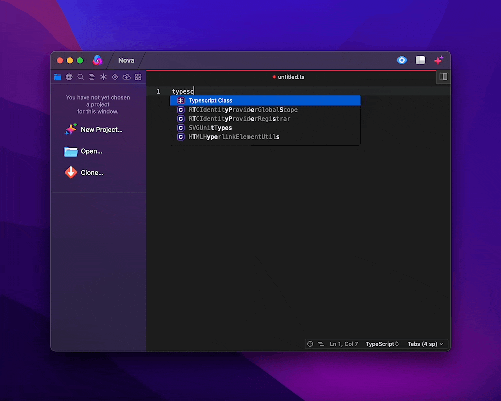
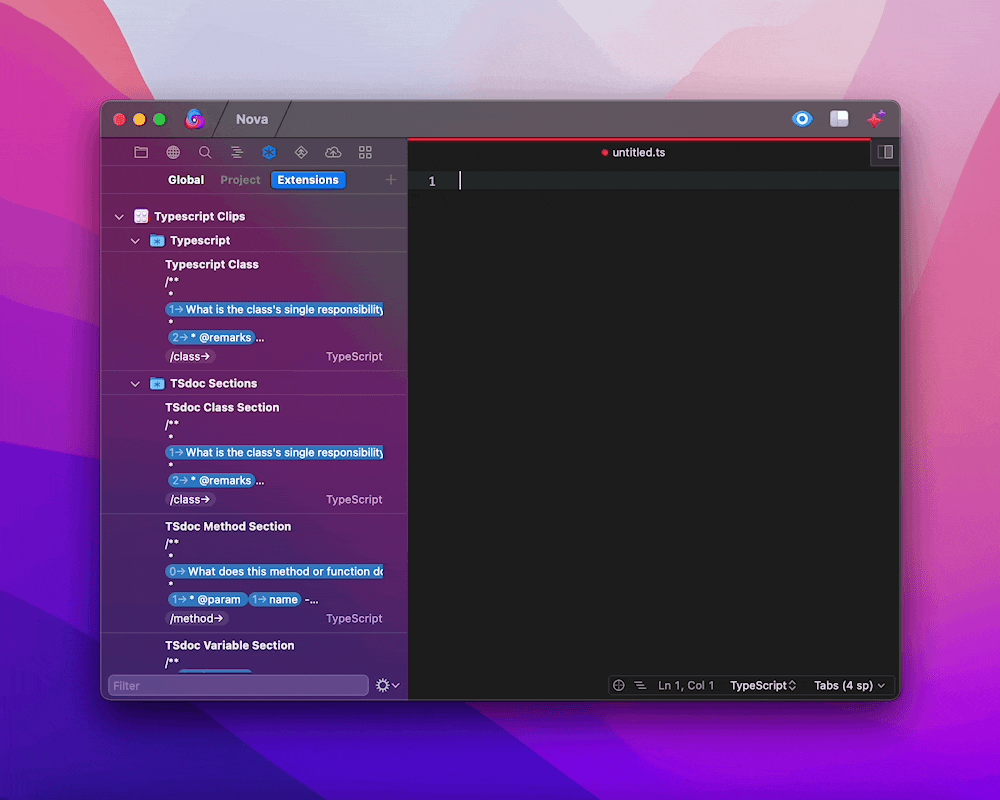
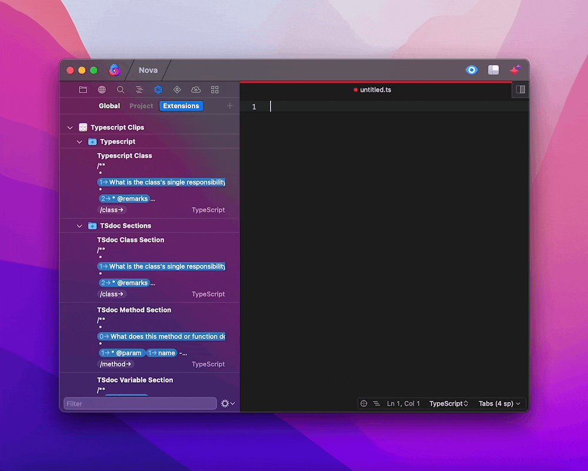
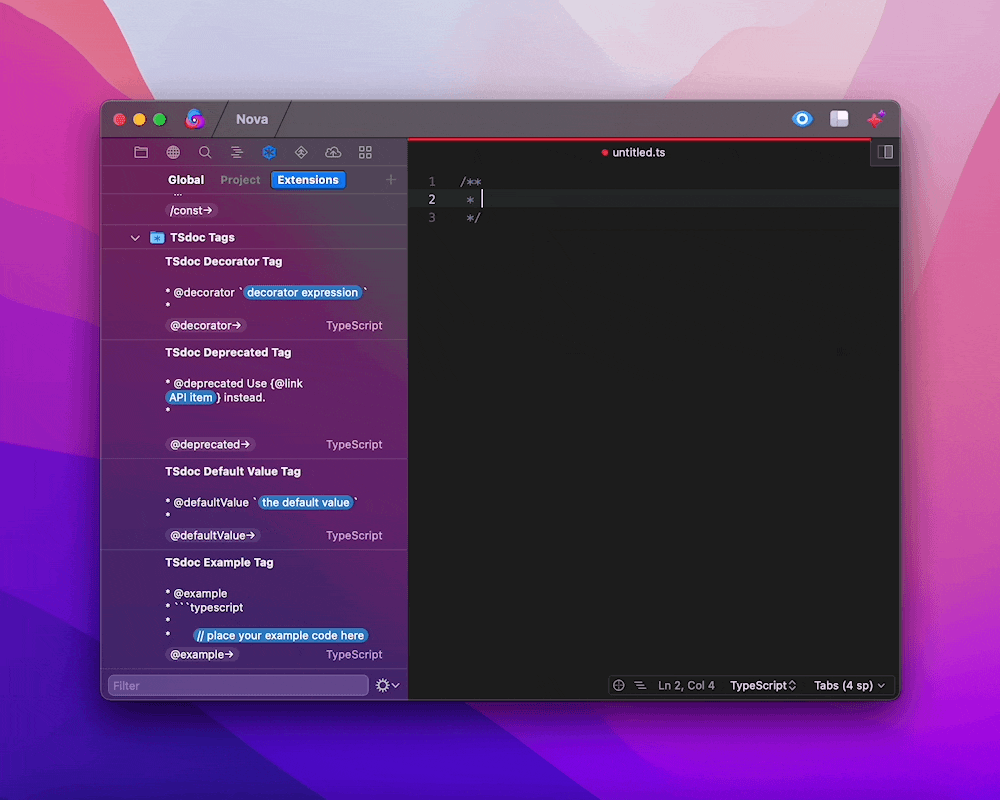
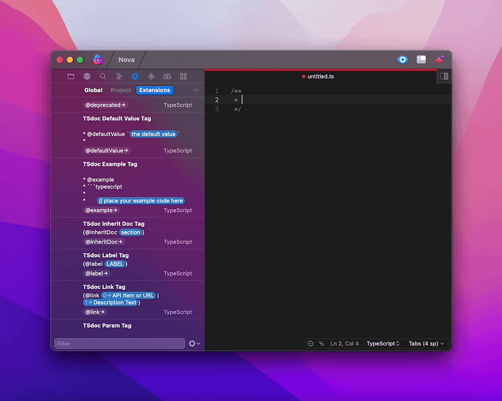
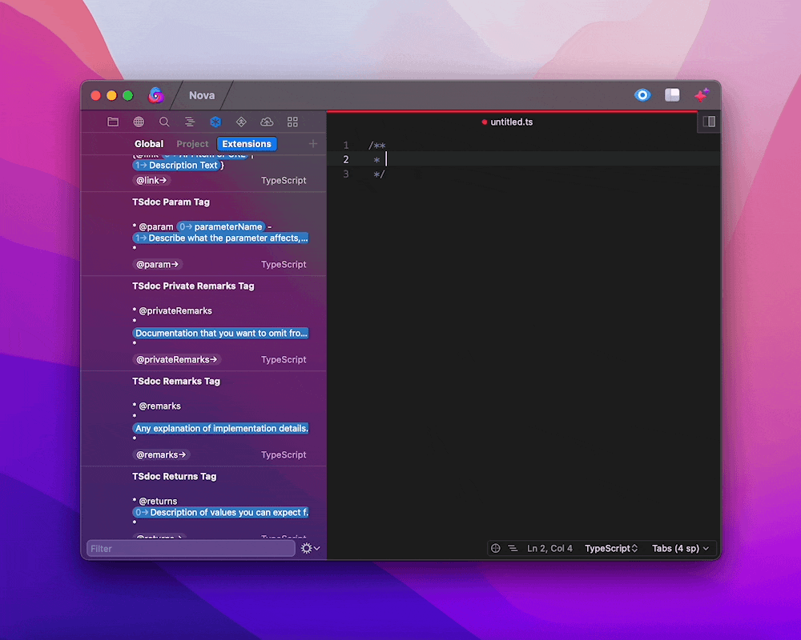
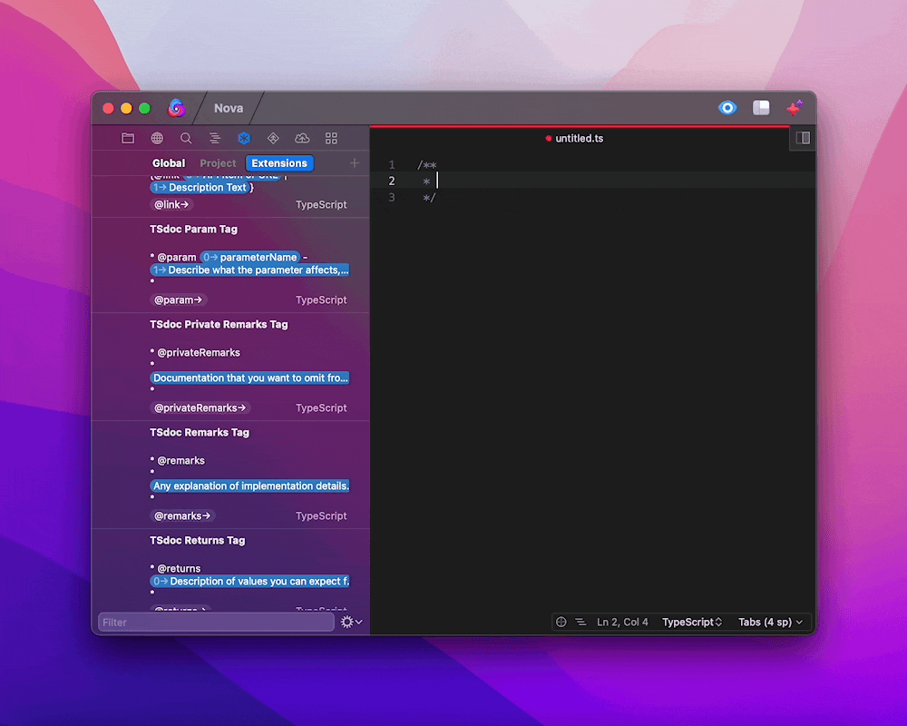
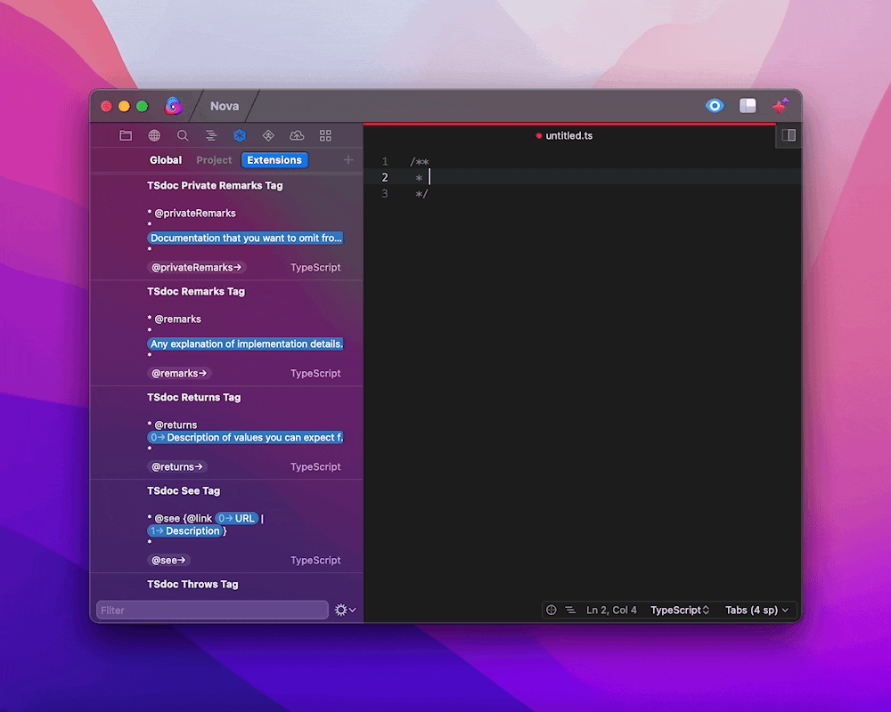
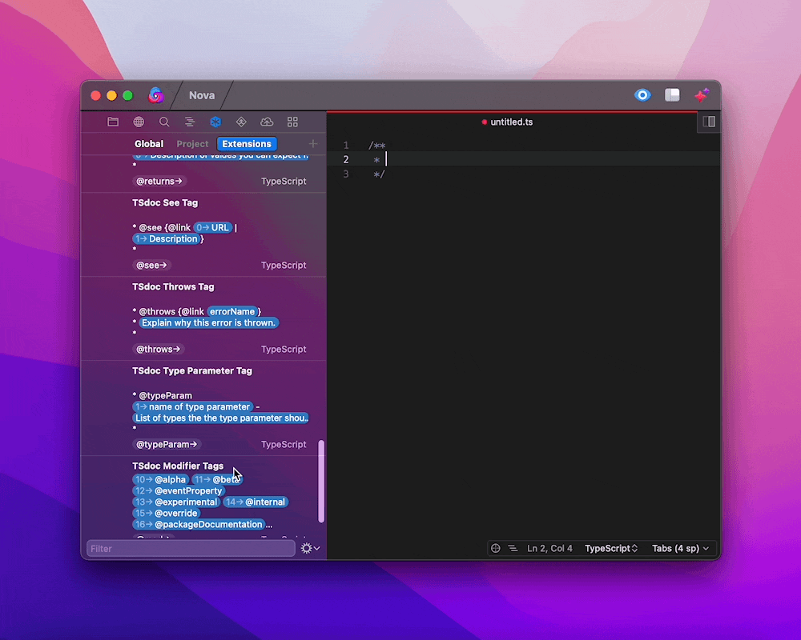
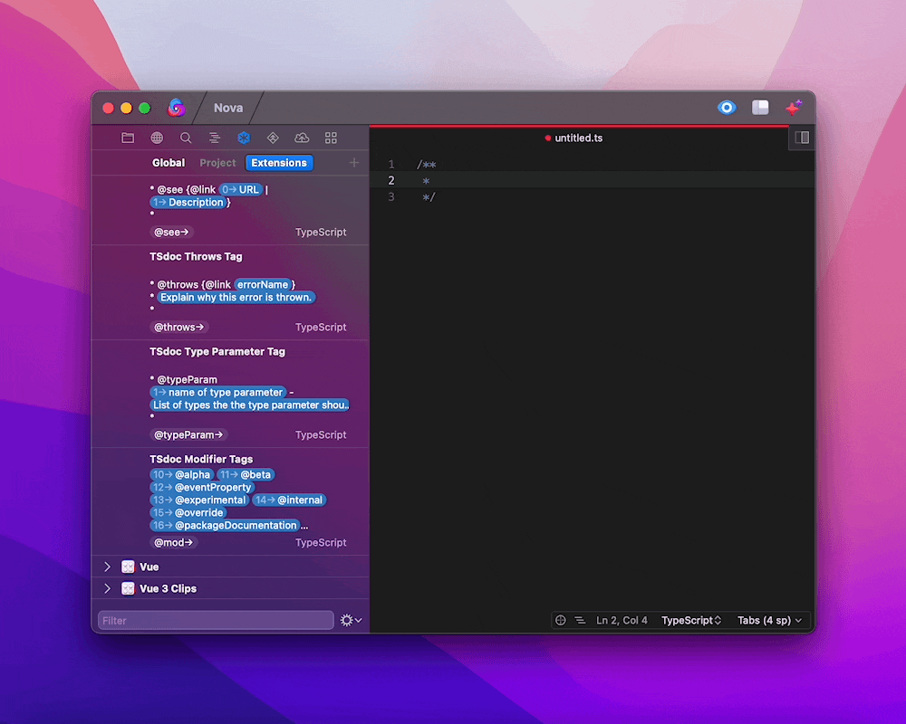

**Typescript Clips** provides clips for **Typescript**, including [TSdoc](https://tsdoc.org) tags.

## Typescript Clips

<!-- * what you want the reader to do -->

<!-- * why?
   * desired outcome
   * underlying problem
   * action
   * compare action to doing nothing -->

<!-- * how tell if succeeded? -->

Use the `typescript class` clip to stub out a Typescript class:


This clip

## TSdoc Clips

Once you write your typescript code, you probably want to share it with someone else. But, before you do that, you should document what it does, and why you wrote it, with TSdoc.

Typescript's first-class support for classes, interfaces, and type declarations makes it easy for programmers to independently write pieces of code that fit together. However, typescript doesn't share the **context** behind the code. The context includes:

1. Why the code was written in the first place.
2. Who the code helps, and what it helps them do.
3. How the code can be used.
4. How the code shouldn't be used.

TSdoc is _the_ standard way to add context to your code. It splits your documentation into **sections**, each of which corresponds to a single function, variable, class or method. It further splits each section into **tags**. Each tag describes a different aspect of the section. Together, they give other developers a comprehensive understanding of the code you wrote. As an added bonus, TSdoc also formats your documentation into a website or markdown file, with [Typedoc](https://typedoc.org).

### Use TSdoc Sections

To use TSdoc, you need to write your documentation inside multi-line comments:

- TSdoc ONLY pays attention to multi-line comments: i.e.:

  ```typescript
  /**
   * comment
   */
  ```

- TSdoc completely ignores single-line comments: i.e.:

  ```typescript
  // comment
  ```

  ```typescript
  /* comment */
  ```

If you don't like manually typing out multi-line comments. No problem, just use the `/doc` clip I've provided.

<!-- show gif of doc snippet -->

TSdoc lumps everything within a multiline comment into a single section:

```typescript
/**
 * This is a section
 */

/**
 * This is another section
 */
```

To split your documentation into sections, all you need to do is make a multiline comment for each section.

But where do you put each section? TSdoc expects you to put each section directly before the piece of code it describes:

```typescript
/**
 * This section describes `const CoffeeBeans`
 */
const CoffeeBeans = 'French Roast';

/**
 * This section describes `function grindCoffeeBeans(...)`
 */
function grindCoffeeBeans(beans: string): string {
  //...
}

/**
 * This section describes `class CoffeeBeanGrinder{ ... }`
 */
class CoffeeBeanGrinder {
  //...

  /**
   * This section describes `public grind(beans:string):string
   */
  public grind(beans: string): string {
    //...
  }
}
```

Every TSdoc section contains a summary, a set of blocks and a list of modifiers:

```typescript
/**
 * <Summary>
 *
 * <Block>
 *
 * <Block>
 *
 * <Block>
 *
 * <Modifier>
 */
```

The summary should contain up to three sentences that explains what the corresponding code does. E.g.:

```typescript
/**
 * GrindCoffeeBeans turns whole beans into powder. It can accept any kind of coffee beans, and can be adjusted to grind powder at varying levels of coarseness.
 *
 * <Block>
 *
 * <Block>
 *
 * <Block>
 *
 * <Modifier>
 */
```

Each block contains a single tag, followed by supporting documentation. You can even format this documentation with [markdown](https://github.com/microsoft/tsdoc/issues/12) and [code fences](https://github.com/microsoft/tsdoc/issues/20) if you want.

```typescript
/**
 * grindCoffeeBeans turns whole beans into powder. It can accept any kind of coffee beans, and can be adjusted to grind powder at varying levels of coarseness.
 *
 * @param beans - the coffee beans you want to grind
 *
 * @returns coffee powder
 *
 * @remarks
 * grindCoffeeBeans actually makes use of the static method {@link CoffeeBeanGrinder.grind} under the hood.
 *
 * <Modifier>
 */
```

The list of modifiers contains tags separated by spaces, none of which are followed by text. E.g.:

```typescript
/**
 * grindCoffeeBeans turns whole beans into powder. It can accept any kind of coffee beans, and can be adjusted to grind powder at varying levels of coarseness.
 *
 * @param beans - the coffee beans you want to grind
 *
 * @returns coffee powder
 *
 * @remarks
 * grindCoffeeBeans actually makes use of the static method {@link CoffeeBeanGrinder.grind} under the hood.
 *
 * @alpha @experimental
 */
```

If all of this is a lot to remember, don't worry, I've made a few clips that make it a LOT easier:

#### Use the `class` clip to document a class. It expands to:



````typescript
/**
 * What is the class's single responsibility?
 *
 * @remarks
 * When should you use the class? What performance benefits or other magical powers does it confer upon you?
 * When shouldn't you use the class?
 * What states does this class furnish?
 * What behaviors does this class furnish?
 * Can you inject dependencies into this class?
 * Are there any situations where it makes sense to extend this class, rather than inject dependencies into it?
 * How does the code in this class work?
 *
 * @example
 * ```typescript
 *	// example of how to use this class here
 * ```
 *
 * @alpha @beta @eventProperty @experimental @internal @override @packageDocumentation @public @readonly @sealed @virtual
 */
````

#### Use the `method` clip to document a method or function. It expands to:



```typescript
/**
 * What does this method or function do?
 *
 * @param name - description
 *
 * @returnstype and meaning of return value
 *
 * @alpha @beta @eventProperty @experimental @internal @override @packageDocumentation @public @readonly @sealed @virtual
 */
```

#### Use the `const` clip to document a variable. It expands to:


```typescript
/**
 * Summary
 *
 * Block Tags
 *
 * @alpha @beta @eventProperty @experimental @internal @override @packageDocumentation @public @readonly @sealed @virtual
 */
```

### Use TSdoc tags:

Remember how I mentioned that every TSdoc section has a summary, blocks, and a list of modifiers? Some tags describe blocks, and others describe modifiers. But that's not all - you can actually tags _within_ blocks. Here are all of the following [tags](https://tsdoc.org/mobile_nav) you can use, grouped by what they describe:

#### Tags that describe blocks:

| Tag                                                             | Trigger                                                                                                  | What it does:                                                                                                                                                        |
| :-------------------------------------------------------------- | :------------------------------------------------------------------------------------------------------- | :------------------------------------------------------------------------------------------------------------------------------------------------------------------- |
| [@decorator](https://tsdoc.org/pages/tags/decorator/)           | `decorator`<br/>                | Quotes an [ES6 decorator](https://www.typescriptlang.org/docs/handbook/decorators.html) expression.                                                                  |
| [@deprecated](https://tsdoc.org/pages/tags/deprecated/)         | `deprecated`<br/>             | Deprecates the code it documents, and recommends an up-to-date alternative.                                                                                          |
| [@defaultValue](https://tsdoc.org/pages/tags/defaultvalue/)     | `defaultValue`<br/>       | Lists value that a property of a class or interface will have if it isn't set.                                                                                       |
| [@example](https://tsdoc.org/pages/tags/example/)               | `example`<br/>                      | Demonstrates how to use the code it documents.                                                                                                                       |
| [@param](https://tsdoc.org/pages/tags/param/)                   | `param`<br/>                            | Describes an argument of a method or function.                                                                                                                       |
| [@privateRemarks](https://tsdoc.org/pages/tags/privateremarks/) | `privateRemarks`<br/> | Contains documentation that should be omitted from any auto-generated documentation site.                                                                            |
| [@remarks](https://tsdoc.org/pages/tags/remarks/)               | `remarks`<br/>                      | Contains an explanation of the implementation details, reasoning, or any other long-form contextual information about the code it documents.                         |
| [@returns](https://tsdoc.org/pages/tags/returns/)               | `returns`<br/>                      | Describes what returns from a method or function.                                                                                                                    |
| [@see](https://tsdoc.org/pages/tags/see/)                       | `see`<br/>                                  | Lists links to other sections of the documentation or websites.                                                                                                      |
| [@throws](https://tsdoc.org/pages/tags/throws/)                 | `throws`<br/>                         | Lists any errors that a method or function throws.                                                                                                                   |
| [@typeParam](https://tsdoc.org/pages/tags/typeparam/)           | `typeParam`<br/>                | Describes the types you can insert into the type argument of a [generic](https://www.typescriptlang.org/docs/handbook/2/generics.html) function, interface or class. |

#### Tags that describe phrases within blocks (also known as inline tags):

| Tag                                                     | Trigger                                                                                      | What it does:                                                                                  |
| :------------------------------------------------------ | :------------------------------------------------------------------------------------------- | :--------------------------------------------------------------------------------------------- |
| [@inheritDoc](https://tsdoc.org/pages/tags/inheritdoc/) | `inheritDoc`<br/> | Copies the `@remarks` `@params` `@typeParam` from another section into the current section.    |
| [@label](https://tsdoc.org/pages/tags/label/)           | `label`<br/>                | Adds an arbitrary label to the block that contains it, so that the block can be referenced it. |
| [@link](https://tsdoc.org/pages/tags/link/)             | `link`<br/>                   | Links to another section, or a website.                                                        |

#### Tags that describe modifiers

Note that the `@mod` clip expands to: `@alpha @beta @eventProperty @experimental @internal @override @packageDocumentation @public @readonly @sealed @virtual`. This includes all of the available modifier clips, each of which occupies its own tab stop. This makes it east to choose the ones you want. Keep in mind that you **must** place these modifiers on the [LAST](https://tsdoc.org/pages/spec/tag_kinds/) line of the TSdoc comment.

<table>
<thead>
<tr>
<th align="left">Tag</th>
<th align="left">Trigger</th>
<th align="left">What it does:</th>
</tr>
</thead>
<tbody>
<tr>
<td align="left"><a href="https://tsdoc.org/pages/tags/alpha/">@alpha</a></td>
<td align="left" rowspan="11" valign="top"><code>mod</code><br/></td>
<td align="left">Marks code as an 'alpha' release.</td>
</tr>
<tr>
<td align="left"><a href="https://tsdoc.org/pages/tags/beta/">@beta</a></td>
<td align="left">Marks code as a 'beta' release.</td>
</tr>
<tr>
<td align="left"><a href="https://tsdoc.org/pages/tags/eventproperty/">@eventProperty</a></td>
<td align="left">Indicates that a method returns a <a href="https://developer.mozilla.org/en-US/docs/Web/API/Event">Browser Event</a> or <a href="https://nodejs.org/api/events.html">Node Event</a>.</td>
</tr>
<tr>
<td align="left"><a href="https://tsdoc.org/pages/tags/experimental/">@experimental</a></td>
<td align="left">Marks code as 'experimental' release.</td>
</tr>
<tr>
<td align="left"><a href="https://tsdoc.org/pages/tags/internal/">@internal</a></td>
<td align="left">Excludes code from a public API.</td>
</tr>
<tr>
<td align="left"><a href="https://tsdoc.org/pages/tags/override/">@override</a></td>
<td align="left">Marks a class as overriding the class from which it inherits.</td>
</tr>
<tr>
<td align="left"><a href="https://tsdoc.org/pages/tags/packagedocumentation/">@packageDocumentation</a></td>
<td align="left">Indicates that a section describes an entire package - not just the code it immediately precedes. <strong>This should only ever be used in the package's entry <code>.d.ts file.</code></strong></td>
</tr>
<tr>
<td align="left"><a href="https://tsdoc.org/pages/tags/public/">@public</a></td>
<td align="left">Marks code as a stable, 'public' release. This code shouldn't change.</td>
</tr>
<tr>
<td align="left"><a href="https://tsdoc.org/pages/tags/readonly/">@readonly</a></td>
<td align="left">Marks a variable or property as being read-only.</td>
</tr>
<tr>
<td align="left"><a href="https://tsdoc.org/pages/tags/sealed/">@sealed</a></td>
<td align="left">Indicates that a class should never be extended.</td>
</tr>
<tr>
<td align="left"><a href="https://tsdoc.org/pages/tags/virtual/">@virtual</a></td>
<td align="left">Indicates that a class can not only be extended, but can also be overridden without consequence.</td>
</tr>
</tbody>
</table>

When you use any of the above clips within a TSdoc section, it will automatically add in the tag name, and a placeholder for any additional text that follows the tag.
