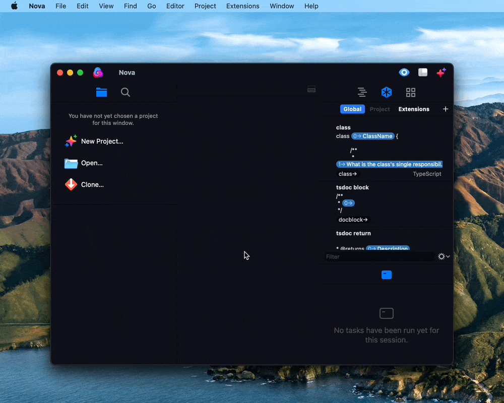
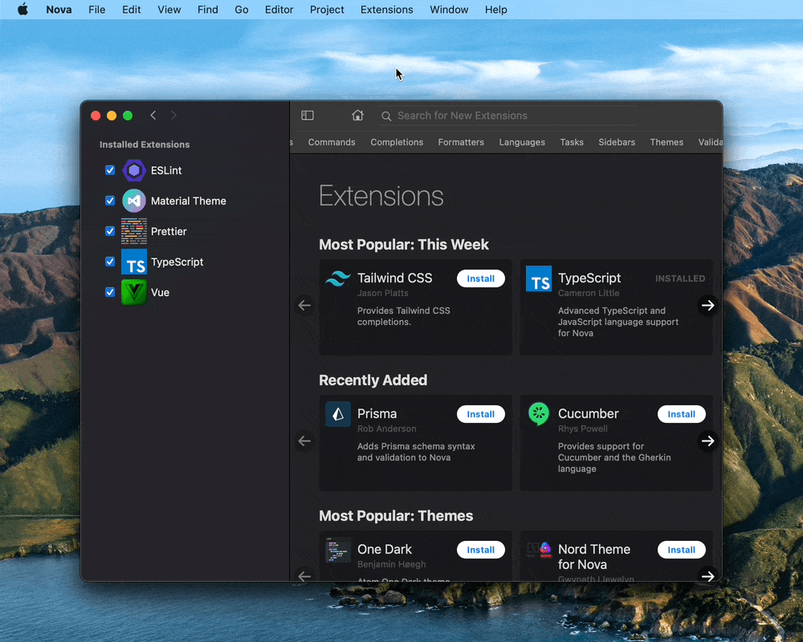
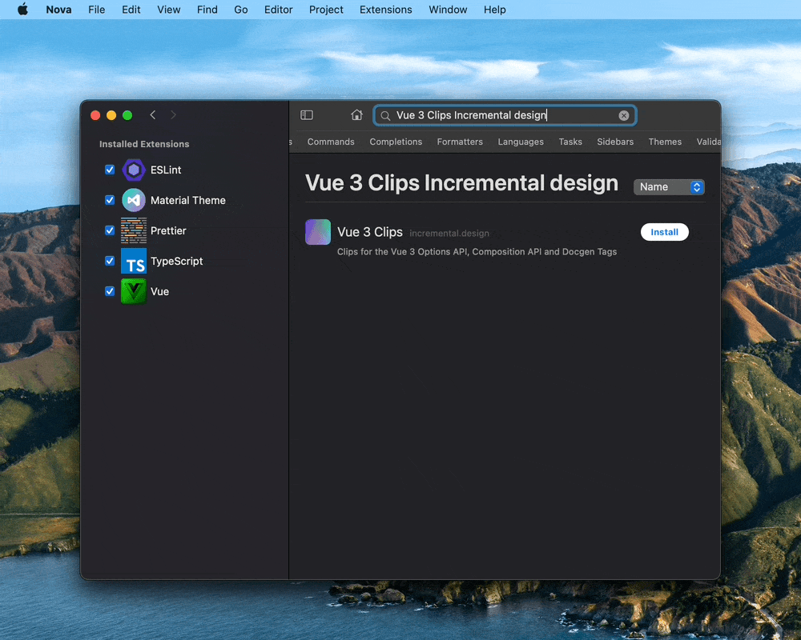
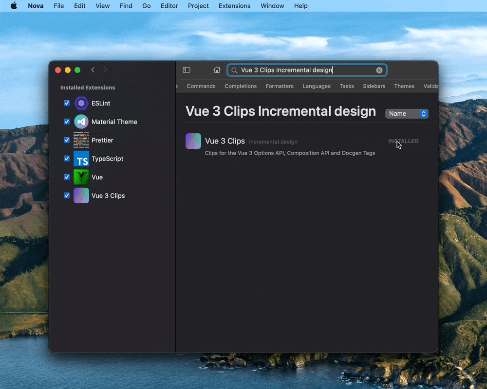
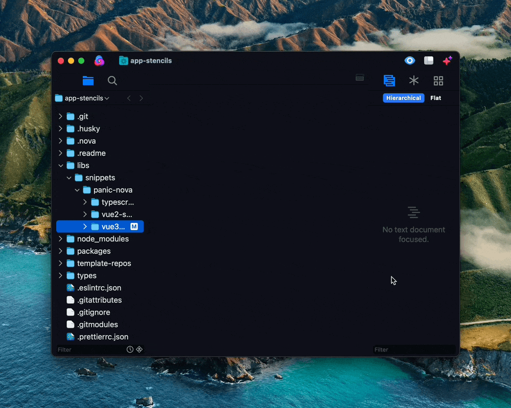
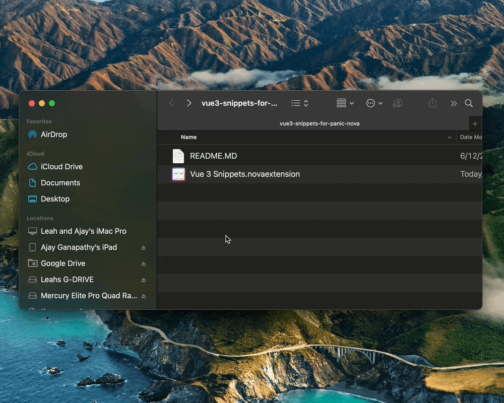
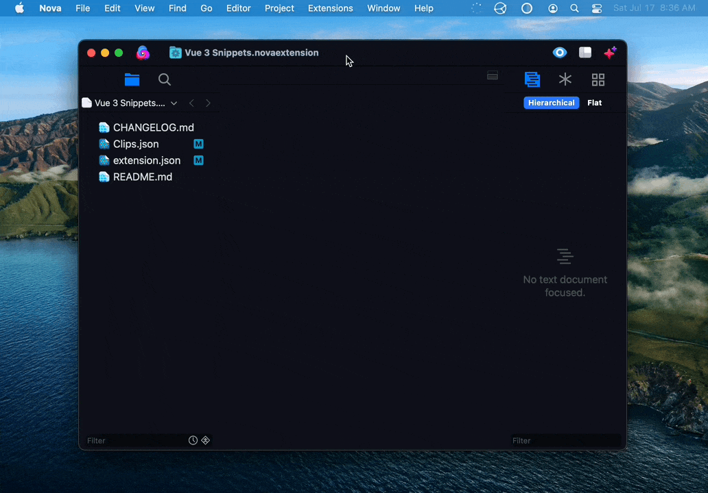
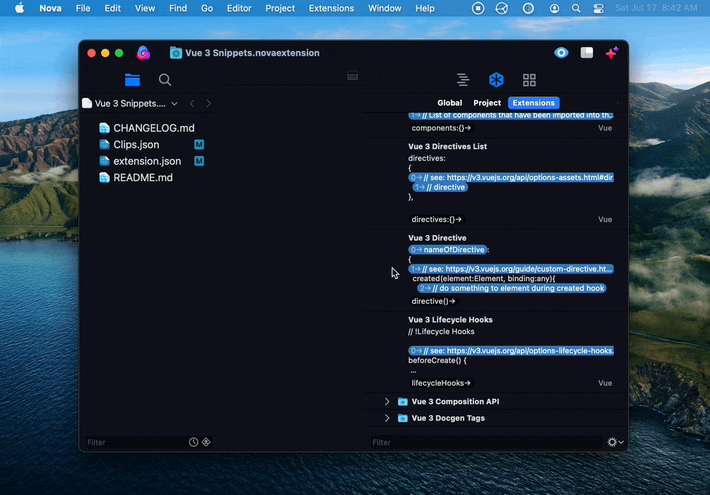

# Vue 3 Clips for Panic Nova

This Nova extension contains clips for Vue 3 projects.

# Installation:

1. Open the Panic Nova Extension Library

   

2. Search for `Vue 3 Clips Incremental Design`.

   

3. Install `Vue 3 Clips`.

   

4. Go to the clips section of the sidebar, click the 'Extensions' tab, and then expand `Vue 3 Clips`

   

# Usage:

How to use Vue 3 Clips for Panic Nova in your codebase:

Type any of the following triggers in any `.vue` file in your project, and Panic Nova will offer the corresponding clip:

| Vue 3 Options API              |     Trigger      |
| ------------------------------ | :--------------: |
| **All Options**                |    `options`     |
| **Props Object**               |    `props:{}`    |
| **Components Object**          | `components:{}`  |
| **Inject Array**               |   `inject:[]`    |
| **Data Constructor Function**  |     `data()`     |
| **Provide Function**           |   `provide()`    |
| **Prop Object**                |    `prop:{}`     |
| **Computed Properties Object** |  `computed:{}`   |
| **Computed Property Object**   |   `compute:{}`   |
| **Methods Object**             |   `methods:{}`   |
| **Method**                     |    `method()`    |
| **Watchers Object**            |  `watchers:{}`   |
| **Watcher**                    |   `watcher:{}`   |
| **Emits Object**               |    `emits:{}`    |
| **Emit Object**                |    `emit:{}`     |
| **Render Function**            |    `render()`    |
| **Components List Object**     | `components:{}`  |
| **Directives List Object**     | `directives:{}`  |
| **Directive**                  |  `directive()`   |
| **Lifecycle Hook Functions**   | `lifecycleHooks` |

| Vue 3 Composition API          |        Trigger        |
| ------------------------------ | :-------------------: |
| **Setup Function**             |       `setup()`       |
| **InjectionKey Function**      |     `const key =`     |
| **Provide Function**           |      `provide()`      |
| **Inject Function**            |   `const inject =`    |
| **Computed Property Function** |     `computed()`      |
| **WatchEffect Function**       |    `watchEffect()`    |
| **Watch Function**             |        `Watch`        |
| **OnBeforeMount Function**     |   `onBeforeMount()`   |
| **onMounted Function**         |     `onMounted()`     |
| **onBeforeUpdate Function**    |  `onBeforeUpdate()`   |
| **onUpdated Function**         |     `onUpdated()`     |
| **onActivated Function**       |    `onActivated()`    |
| **onDeactivated Function**     |   `onDeactivated()`   |
| **onBeforeUnmount Function**   |  `onBeforeUnmount()`  |
| **onUnmounted Function**       |    `onUnmounted()`    |
| **onErrorCaptured Function**   |  `onErrorCaptured()`  |
| **onRenderTracked Function**   |  `onRenderTracked()`  |
| **onRenderTriggered Function** | `onRenderTriggered()` |

| Vue 3 Docgen Tags  |    Trigger     |
| ------------------ | :------------: |
| **Values Tag**     |   `@values`    |
| **Deprecated Tag** |   `@values`    |
| **Link Tag**       |   `@values`    |
| **Author Tag**     |   `@values`    |
| **Since Tag**      |   `@values`    |
| **Ignore Tag**     |   `@values`    |
| **Slot Tag**       | `<!-- Slot ->` |

## How Vue 3 Clips for Panic Nova works:

Vue 3 Clips is a [Panic Nova Extension](https://docs.nova.app/extensions/) that automatically adds clips to your editor.

# Contribute to Vue 3 Clips for Panic Nova:

To add or change clips, you need to install a copy of Panic Nova, and you also need to [clone and setup](https://github.com/incremental-design/app-stencils#contribute-to-app-stencils) the `app-stencils` monorepo.

## Repository Structure:

| File or Folder                                | What it does                                                                                                                                                  | Can you modify it? |
| --------------------------------------------- | ------------------------------------------------------------------------------------------------------------------------------------------------------------- | ------------------ |
| `.readme/*`                                   | Contains all of the images referenced in this file. Everything in this folder is versioned with Git-LFS                                                       | Yes                |
| `Vue 3 Snippets.novaextension/*`              | Contains everything used in the nova extension. This folder gets published to the nova extension library.                                                     | Yes                |
| `Vue 3 Snippets.novaextension/CHANGELOG.MD`   | Describes the changes that occured between releases.                                                                                                          | Yes                |
| `Vue 3 Snippets.novaextension/Clips.json`     | Contains all of the clips that this extension provides.                                                                                                       | Yes                |
| `Vue 3 Snippets.novaextension/extension.json` | Contains the [manifest](https://docs.nova.app/extensions/manifest/) for this extension. This file tells Nova how to install the other files in the extension. | Yes                |
| `Vue 3 Snippets.novaextension/extension.png`  | The icon that is displayed next to the extension in the extension library.                                                                                    | Yes                |
| `Vue 3 Snippets.novaextension/README.md`      | The [documentation](https://extensions.panic.com/extensions/incremental.design/incremental.design.Vue3Clips/) that is displayed in the extension library.     | Yes                |

## Develop:

1. Locate the `libs/snippets/panic-nova/vue3-clips-for-panic-nova` folder in the `app-stencils` repository. Then, open it in Finder.

   

2. Open the `Vue 3 Clips.novaextension` package with Panic Nova. Then, select "open for editing".

   <!-- this gif is out of date ... it should say 'Vue 3 Clips, but instead it says 'Vue 3 Snippets' -->

   

3. Go to `Extensions > Activate Project as Extension`. Then, go to the clips section of your sidebar, switch to the `extensions` tab, and find the clips in this extension.

   

### Document:

Whenever you modify this extension, make sure you describe the modifications in `Vue 3 Snippets.novaextension/README.md`.

Whenever you submit this extension to the extension library, make sure you describe updates in `Vue 3 Snippets.novaextension/CHANGELOG.md`

## Deploy:

Go to `Extensions > Submit to the Extension Library` and follow the prompts.

