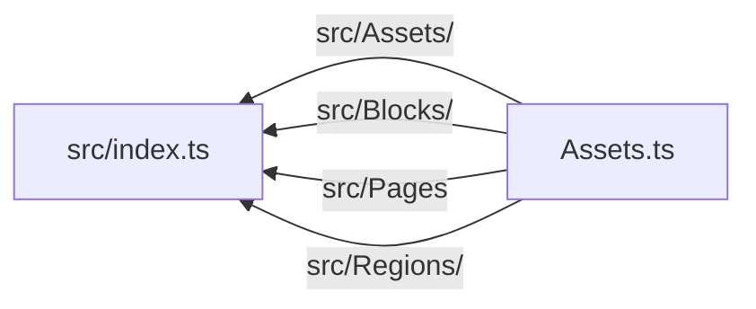

# shared-squarespace-template-generator

This library was generated with [Nx](https://nx.dev).

## Building

Run `nx build shared-squarespace-template-generator` to build the library.

## Running unit tests

Run `nx test shared-squarespace-template-generator` to execute the unit tests via [Jest](https://jestjs.io).

# Project Name

<!--
Add a banner image and badges

see: https://towardsdatascience.com/how-to-write-an-awesome-readme-68bf4be91f8b
-->

<!-- link to your reader to your repository's bug page, and let them know if you're open to contributions -->

## Installation:

Add Project Name to your codebase.
asciicast, video or GIF of adding to your project and using it

## Usage:

[ ] Make a bulleted list of each class, method, or function that your project exports. Link each list item directly to the file that defines it.

### How Project Name works:

[ ] Explain how execution works. What is the entry point for your code? Which files correspond to which functionality? What is the lifecycle of your project? Are there any singletons, side effects or shared state among instances of your project? Take extra care to explain design decisions. After all, you wrote an ENTIRE codebase around your opinions. Make sure that your repository's contributors understand them.

## Roadmap:

[ ] List the releases that you have added to each project, and any future releases you would like to do. If there is a date for future release, put it here. If not, let people know that there is no defined timeframe for future releases.

## Contribute to Project Name:

[ ] Describe the tooling needed to develop your project in 3 sentences or less. Then list each step to set that tooling up.

### Setup:

[ ] Describe the tooling needed to develop your project in 3 sentences or less. Then list each step to set that tooling up.

asciicast or GIF of install prerequisites

#### Repository Structure:

[ ] Make a bulleted list of files and folders, and what each does. Develop:
[ ] List the steps for running, testing and documenting the code

### Run:

### Test:

### Document:

### Deploy:

[ ] List the steps for deploying project name as a package

unfortunately, squarespace development server is a java app. it has to be installed in global npm

the best path around this is to install it in a docker container, attach to container, and then interact with it from there. But, that's out of scope right now. So, for now just `npm install -g @squarespace/server`

the idea of the squarespace template generator is to:

0. add in build hooks e.g. `<!--vite scripts-->`
1. scan a squarespace template, and create a config object that lists everything that is in the template
2. output a manifest of the original template contents
3. add to the configuration object: include custom styles, components, etc
4. build styles and components, and place them back into the original template
5. on every rebuild, delete anything that is not present in the manifest of original template contents
